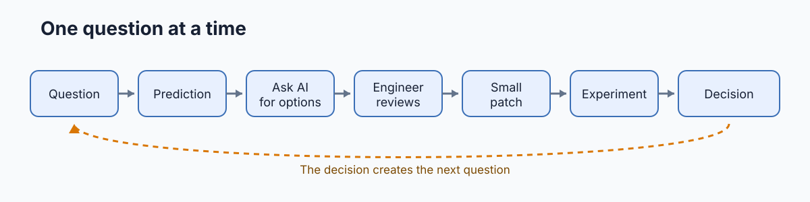
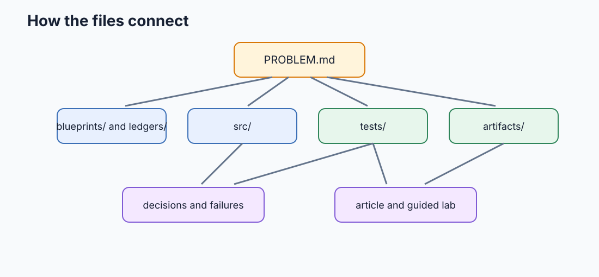
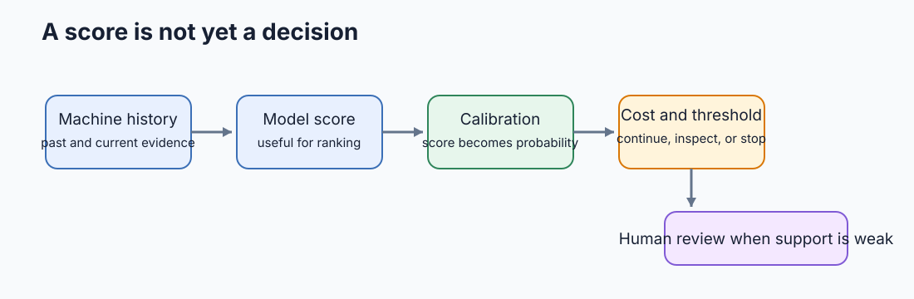
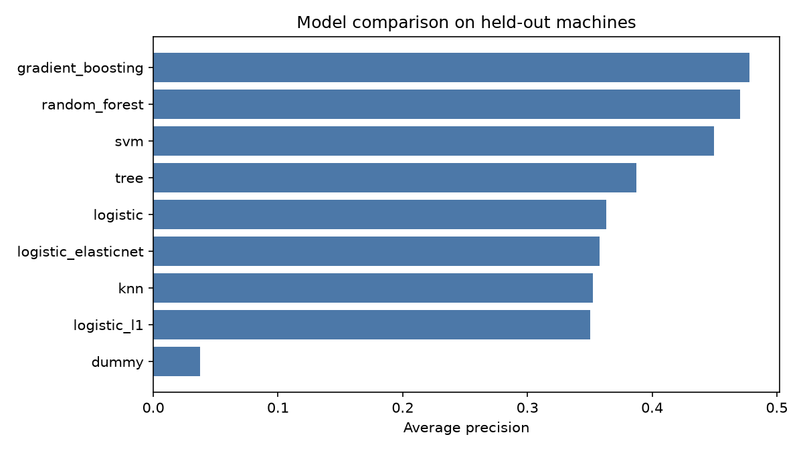
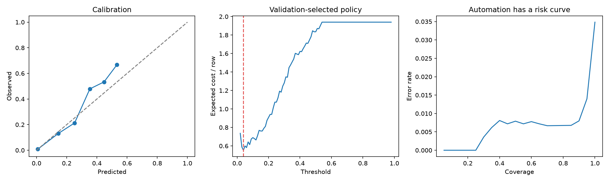

# TinyML maintenance lab

A machine is getting hotter and vibrating more than usual. Should the operator keep it running, inspect it, stop it, or ask a person to review the case?

This repository builds that decision with classical machine learning and an AI coding agent. The models come from scikit-learn. The engineering work is deciding what to predict, which evidence is honest, how to test it, and when the system should refuse to automate.

## Student starting point

Open this repository in a terminal-based coding agent such as Codex or Claude Code. You do not need to read the technical article or understand the repository before you begin. The coach starts with the machine problem, then helps you inspect one small piece at a time.

First, prepare the environment:

You need Python 3.11 or newer and [uv](https://docs.astral.sh/uv/).

~~~bash
uv sync --extra dev
uv run tinyml-maintenance lab doctor
~~~

Then copy this complete prompt into the coding agent:

~~~text
Read .agents/skills/tinyml-lab-coach/SKILL.md and follow it.

Start Phase 00 in beginner mode. Assume I have not read the technical article
and may be new to predictive maintenance.

Explain the machine problem and what I will learn before asking me about
repository files. Ask one question at a time. If I do not understand, explain
the idea with a concrete example instead of repeating the question.

Use the repository and terminal to inspect real evidence. After we agree on my
answers, draft and save my learning record in .tinyml-lab/student-log.md. Do not
invent an answer, file inspection, command, experiment, or claim that I
understand something. Let me review the saved entry before moving to the next
phase.
~~~

That is the starting point. The coach will explain, ask a small question, help you inspect a real file or result, and review your answer. You will slowly take on more responsibility across the nine phases. It is a self-guided, hands-on lab; you do not need an instructor or a collaborator beside you.

If your agent uses Claude's skill directory, replace the first line with:

~~~text
Read .claude/skills/tinyml-lab-coach/SKILL.md and follow it.
~~~

For a phase-by-phase example, read [how to use the student lab](docs/STUDENT_LAB_GUIDE.md). You can also start or inspect progress yourself with these commands:

~~~bash
uv run tinyml-maintenance lab start
uv run tinyml-maintenance lab status
uv run tinyml-maintenance lab show 01
uv run tinyml-maintenance lab check 00
uv run tinyml-maintenance lab next
~~~

Your answers and progress stay in `.tinyml-lab/`, which Git ignores. You may write the learning record yourself, or the coach can draft and save it from your answers for you to review.

The repository includes a beginner-first coach at `.agents/skills/tinyml-lab-coach/SKILL.md` and a Claude entry point at `.claude/skills/tinyml-lab-coach/SKILL.md`. The CLI runs reproducible checks; the coach explains concepts, reviews understanding, and helps keep the learning record.

## Pick a path

| If you are | Start with | Continue with |
|---|---|---|
| New to machine learning | [Phase 00](labs/00-start-here/README.md) | Follow phases in order |
| A working professional | [The technical article](blog/index.md) | Run phases 05, 07, and 08 |
| Preparing for interviews | [AI use policy](AI_USE.md) | Complete the lab and [90-minute challenge](challenge/README.md) |
| Reviewing the implementation | [Problem contract](PROBLEM.md) | Read tests, failures, and AI ledgers beside the code |

## The nine guided phases

| Phase | Question | Time |
|---|---|---:|
| [00 Start here](labs/00-start-here/README.md) | What is this project trying to predict, and why? | 20 min |
| [01 Define the decision](labs/01-problem/README.md) | What must the system predict, and why? | 35 min |
| [02 Build and inspect data](labs/02-data/README.md) | Can we create histories without leaking the future? | 55 min |
| [03 Use EDA](labs/03-eda/README.md) | Which observation changes the next experiment? | 45 min |
| [04 Build a baseline](labs/04-baseline/README.md) | How can 96 percent accuracy catch no failures? | 55 min |
| [05 Compare models and splits](labs/05-models-and-splits/README.md) | What should generalize to a new machine? | 75 min |
| [06 Try other views](labs/06-alternative-views/README.md) | What do useful life and clusters add? | 60 min |
| [07 Choose an action](labs/07-calibration-and-policy/README.md) | How does a score become an operating decision? | 75 min |
| [08 Test shift and hand off](labs/08-shift-and-handoff/README.md) | What should happen when the world changes? | 65 min |

Every phase uses the same learning loop, with less support as you progress:

~~~text
EXPLAIN -> EXPLORE -> RUN -> INTERPRET -> REVIEW -> RECORD
~~~

The coach explains early concepts before asking questions. Later phases require predictions, evidence review, and engineering judgment. The prompts do not ask AI to build the whole project.

## What the repository contains

| Path | Why it exists |
|---|---|
| PROBLEM.md | Prediction and operating contract |
| src/tinyml_maintenance/ | Data, models, evaluation, policy, reports, and lab CLI |
| tests/ | Software checks and ML invariants |
| artifacts/ | Reproducible figures and result tables |
| blueprints/ | Tasks agreed before implementation |
| ai-ledger/ | What AI proposed and what review changed |
| DECISIONS.md | Choices that affect the system |
| FAILURES.md | Wrong hypotheses and corrected implementations |
| labs/ | Guided learning phases |
| challenge/ | Independent 90-minute extension |

## What you will build and question

The project covers:

- synthetic, time-ordered machine histories;
- exploratory analysis tied to a decision;
- dummy and logistic baselines;
- L1, L2, and elastic-net regularization;
- decision tree, random forest, gradient boosting, SVM, and KNN;
- group, temporal, unseen-type, and deliberately unsafe random splits;
- remaining useful life regression;
- PCA, k-means, DBSCAN, and Gaussian mixtures;
- calibration, cost-based thresholds, abstention, and action policy;
- slice analysis and distribution shift.

## Look at the evidence

The complete run creates all figures and result files:

~~~bash
uv run tinyml-maintenance all
uv run pytest
~~~

The article is generated from the saved JSON and CSV files:

- [Read the technical article](blog/index.md)
- [Inspect the experiment contracts](EXPERIMENTS.md)

## Where AI helps and where the engineer decides

| AI helps with | The engineer decides |
|---|---|
| Inspecting unfamiliar code | What the deployment question is |
| Proposing model and test options | Which evidence exists at prediction time |
| Writing one bounded patch | Which split and metric answer the question |
| Diagnosing a failed check | Whether the result changes the decision |
| Finding unnecessary code | When automation should stop |

Read [AGENTS.md](AGENTS.md) for repository rules given to coding agents. Read [AI_USE.md](AI_USE.md) for the review sequence. The [Ponytail audit](ai-ledger/B07-ponytail-audit.md) shows the final complexity pass and the code it removed.

## Finish with the independent challenge

The guided phases teach the workflow. The [90-minute extension challenge](challenge/README.md) tests whether you can use it without step-by-step coaching.

You join this working repository as if another team handed it to you. Your task is not to build a second ML project. You choose one small capability, such as monitoring calibration drift, setting thresholds per machine family, or adding a new machine type. Then you find the correct extension point, write a blueprint, ask AI for one bounded patch, test the meaningful failure case, and run a controlled experiment.

The challenge evaluates both the result and the way you reached it. You must show what AI proposed, what you verified, what you changed or rejected, and which engineering decision remained yours. A good submission is a small, reproducible change that another engineer can understand and continue.

The challenge guide includes a suggested 90-minute schedule, a worked example, a copy-paste starting prompt, required evidence, and the definition of done. The [rubric](challenge/RUBRIC.md) scores repository comprehension, AI use, ML judgment, testing, experimentation, simplicity, and handoff quality.
